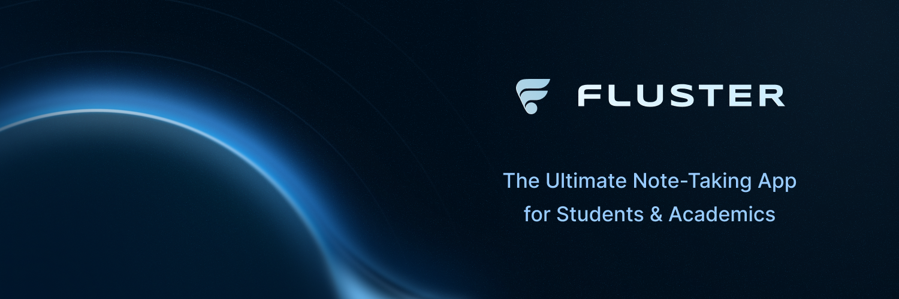

# FlusterIO

Fluster is a free, open source note taking application designed for the modern academic. Powered by Rust with a complete bibliography manager, a task manager, a snippets database, an equations database, and much, much more, Fluster is the perfect companion for whatever it is that you're studying.

Learn more by visiting our website at [https://fluster-one.vercel.app](https://fluster-one.vercel.app). (Chip in and we might even be able to afford a real domain.)

## Features

> Almost all missing features were present in the initial, browser based version of Fluster. The remaining features are almost all half-implemented. The remainder of an initial version of Fluster will come together quickly, hopefully making all of these features available by fall of 2025. If you can, please consider supporting the continued development of Fluster... I've been homeless for more than 3 years after leaving a career in software to pursue a modified model of relativity in my field of formal education, physics, so every little bit helps.

- [x] Almost all logic implemented in Rust. (with rare exceptions to avoid calling the same method multiple times)
- [x] Bibliography manager
  - [x] Link pdf's
  - [x] Internal PDF viewer (may experience bugs in initial release)
  - [x] Customize citation format using any valid `.csl` file
  - [x] Use a user provided `.bib` file to source citations.
- [x] Task Manager
  - [x] Task notes accept the same mdx content as the rest of Fluster mdx content.
  - [x] Embeddable task list, allows the user to embed a subset of their tasks directly in a note.
- [x] Mdx notes, with a list of embeddable components.
- [x] Internal, embedded documentation
- [x] Local AI chat (model responds in mdx supported elsewhere throughout the app)
  - On initial launch Fluster will download the necessary models to provide the user with completely offline LLM support.
  - [x] Vector Search
  - [x] RAG Support (work in progress)
  - [ ] Support for remote LLM providers.
- [x] Navigate by:
  - [x] Text search
  - [x] Vector search
  - [x] Tag
  - [x] Topic
  - [x] Subject
  - [x] Command Palette
- [ ] Kanban Boards
- [x] A user defined dictionary using a special code block directly in the user's notes.
- [x] An equations database that can in turn be used to find notes with related equations.
- [x] A snippets database
- [x] An internal editor, powered by Monaco.
  - [x] Vim keymap support
- [x] Customizable themes
  - [ ] Customizable color props (will be added to settings page in coming weeks)
- [x] Keyboard based navigation support for maximum productivity
  - While this is coming along well, this will be an ongoing process that will continue to get better with time.
  - [x] Customizable keymaps (keymaps are in place, but settings page to customize keymaps is not yet implemented)
- [ ] Jupyter Support (currently in progress. Will be available within 2 weeks from initial launch)
  - [ ] Embeddable cells
  - [ ] Complete support for `ipynb` files.
  - [ ] Render complete notebooks in 'view' mode
- [ ] Interactive plotting (partially complete. Will be available within 2 weeks from initial launch.)
  - [x] 2-d Line plot
  - [x] 2-d Scatter plot
  - [x] Pie chart
  - [x] 3-d Line plot
  - [x] 3-d Scatter plot
  - [x] 3-d Surface plot
  - [x] Mermaid diagram support
- [x] Support for gltf files and 3d model rendering.
- [ ] Tabular data support (currently in progress. Expected this week.)
  - [ ] View as data table
  - [ ] Auto-generate interactive plots
- [ ] Plugin support
  - **_IMPORTANT_** This was perhaps my single greatest priority when re-writing Fluster. The entire architecture was built to support a variety of plugins. While additional plugin features may have to wait until fall, the ability to provide your own React components will likely be supported sometime in July of 2025.

## SDK's

- [ ] Python (in progress. Will be released this summer).
- [x] Typescript (used internally)
- [ ] Go (will build out with cli in coming weeks)
- [ ] Rust (partially complete)

## Sidenote

If anyone out there is hiring, I'm very much looking for work. As I mentioned above, 3+ years ago I basically quit my entire life to work on a modified model of relativity that has produced incredible results. I really couldn't see myself going back to work until I checked that box, and now with that behind me, I'm beyond ready to return to work. 3+ years living in my car has taken it's toll on my, both mind and body. Feel free to send me an email at [fluster.eyeoh@gmail.com](mailto:fluster.eyeoh@gmail.com). I have experience with Typescript, Rust, Go, Python, Dart and a little bit of Lua.
